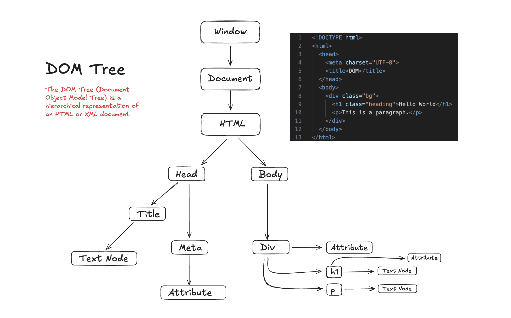

# DOM (Document Object Model)

The Document Object Model (DOM) is the data representation of the objects that comprise the structure and content of a document on the web. It represents the page so that programs can change the document structure, style, and content. The DOM represents the document as nodes and objects; that way, programming languages can interact with the page.

# DOM Tree

The DOM tree (Document Object Model tree) is a hierarchical representation of the structure of a web document, such as an HTML or XML page. It reflects how the browser interprets and organizes the page's content into a tree-like data structure.

## Key Concepts:
- DOM stands for Document Object Model.
- The DOM turns HTML elements into nodes arranged in a tree structure.
- Each node represents a part of the document (like an element, text, or comment).

## Types of Nodes:
- **Element nodes**: HTML elements like `<body>`, `<h1>`, `<p>`.
- **Text nodes**: The text inside those elements.
- **Attribute nodes**: Attributes like `class`, `id`, etc. (usually accessed via element nodes).
- **Comment nodes**: HTML comments like `<!-- comment -->`.

## Why It Matters:
The DOM allows JavaScript to interact with and modify the page dynamically.

For example: document.getElementById("myId") gets a node, and you can change its content or style.

## DOM Tree Example


## Accessing and Manipulating the DOM with JavaScript

### 1. Selecting Elements
`document.getElementById("myId");`
`document.querySelector(".myClass");`
`document.querySelectorAll("div");` <!-- NodeList of all divs -->

### 2. Changing Styles
`const title = document.getElementById("title");`
`title.style.backgroundColor = "blue";`
`title.style.color = "white";`
`title.style.padding = "12px";`
`title.style.borderRadius = "15px";`

### 3. Changing Content
`title.textContent = "DOM DOM DOM";`
`title.innerHTML = "<span>DOM</span>";`
`title.innerText = "DOM DOM";` <!-- Only shows visibile text -->

#### Difference Between textContent, innerHTML, innerText

| Property      | Description                                                                 | Includes HTML Tags  | Performance  | Hidden Elements Affected? |
|---------------|-----------------------------------------------------------------------------|---------------------|--------------|---------------------------|
| `textContent` | Returns or sets the **text** content of an element and all its descendants. | ❌ No                | ✅ Fast       | ❌ No                    |
| `innerHTML`   | Returns or sets the **HTML markup** inside the element.                     | ✅ Yes               | ⚠️ Slower     | ✅ Yes                   |
| `innerText`   | Returns or sets the **visible text** of the element (CSS-aware).            | ❌ No                | ⚠️ Slower     | ✅ Yes                   |


- 💡 **Note:** `innerText` is affected by CSS styles (e.g., `display: none`), while `textContent` is not.

### 4. Changing Attributes
`title.setAttribute("class", "heading common");`
`title.getAttribute("class");`
`title.removeAttribute("class");`

### 5. Adding/Removing Elements


### 6. Event Listeners
```javascript
const btn = document.getElementById("myBtn");
btn.addEventListener("click", () => {
  alert("Button clicked!");
});
```


### More:
[DOM - MDN Web Docs](https://developer.mozilla.org/en-US/docs/Web/API/Document_Object_Model/Introduction)
